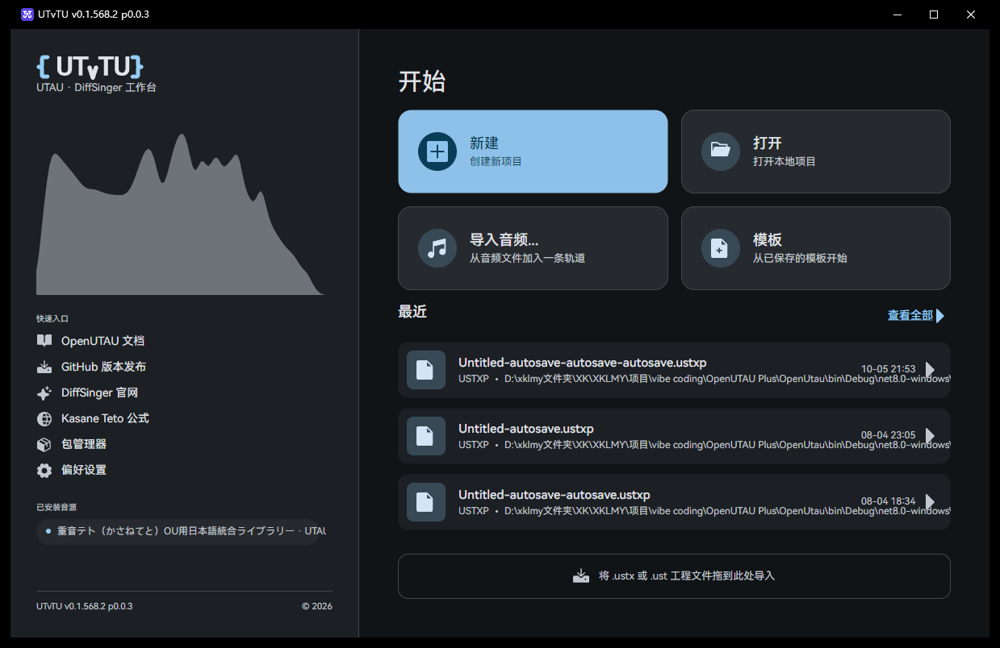
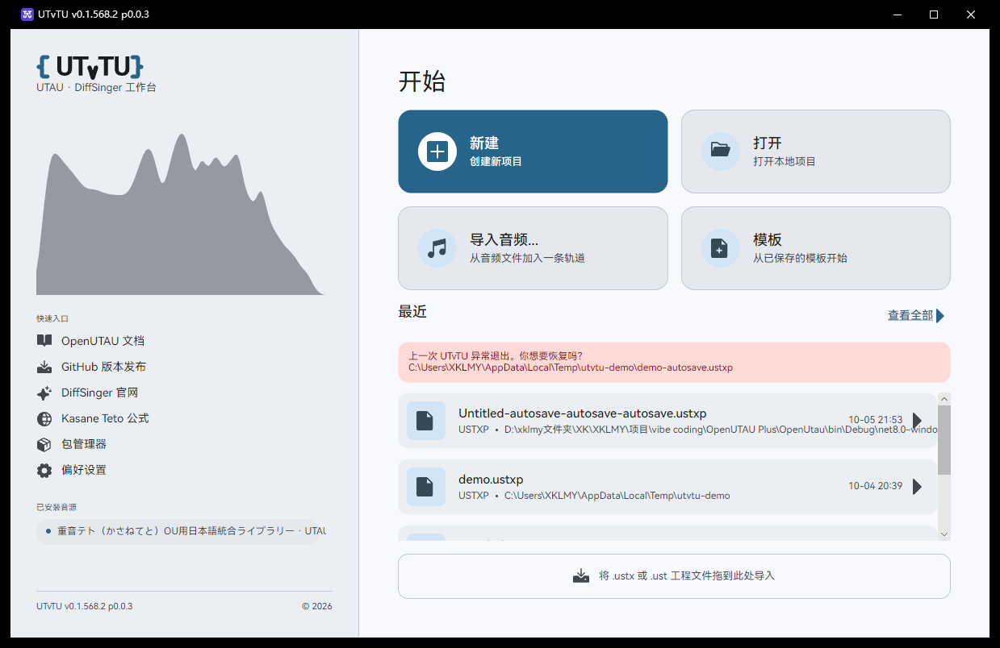
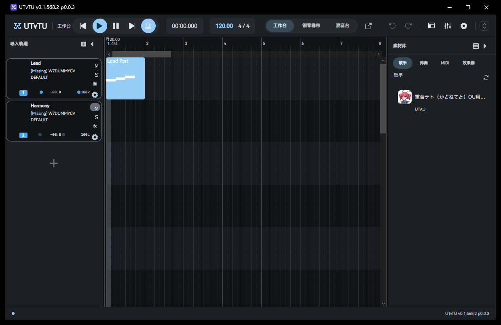
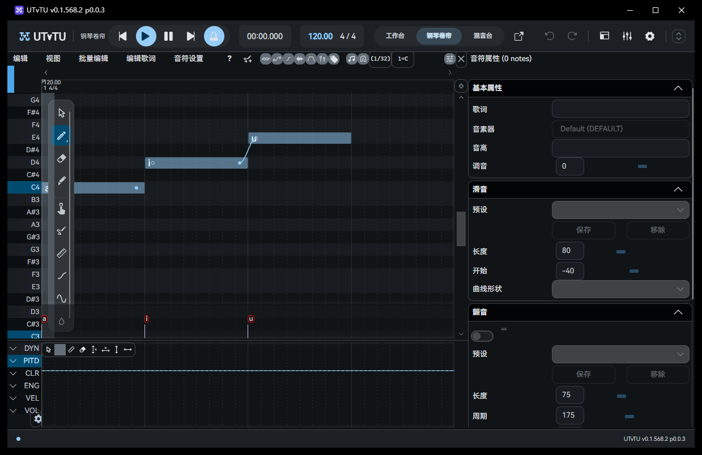
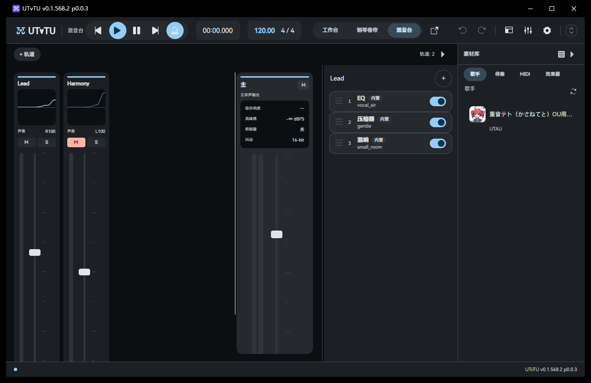
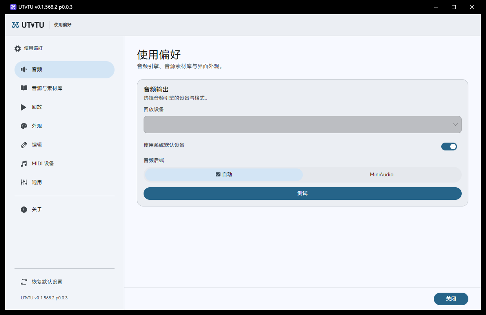
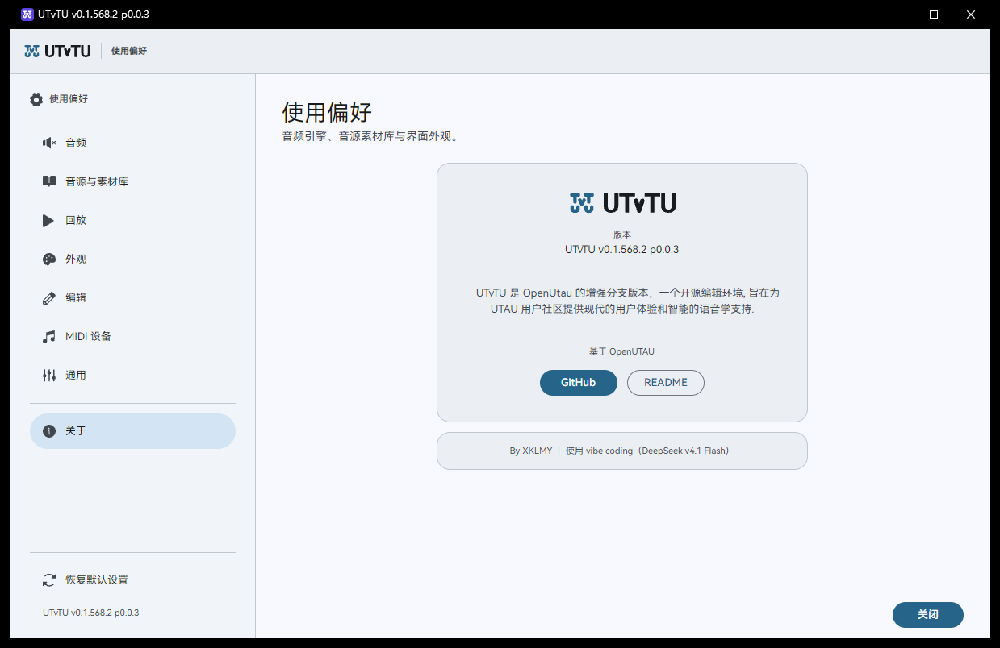

# UTvTU

> **UTvTU** —— 此前名为 **OpenUTAU Plus**。2026-10 起更名并全量迁移至本仓库
> （[github.com/XKLMY-hi/UTvTU](https://github.com/XKLMY-hi/UTvTU)）；旧仓库
> [OpenUTAU-Plus](https://github.com/XKLMY-hi/OpenUTAU-Plus) 仅作历史存档。
> **更名不影响代码与用户数据目录**（数据目录仍为 `OpenUtau Plus`，无需任何迁移操作）。

**OpenUTAU** 的增强分支 —— 带 DAW 混音台、VST3 效果器插件与常驻素材库的歌声合成工作站，
界面为自研 Material Design 3 体系（2026-09 起，已移除第三方控件库）。

基于 [OpenUTAU](https://github.com/openutau/OpenUtau) (MIT License)

---

## 界面预览

> 截图取自 **2026-10 当前构建**（自研 Material Design 3 体系），窗口 1239×804。
> 深色为默认主题，浅色一键切换（**使用偏好 → 外观**）；视图快捷键 **`Ctrl+1/2/3`** = 工作台 / 钢琴卷帘 / 混音台。

**欢迎页** —— 品牌锁定 `{ UTvTU }` + 真实演唱的**响度图形** + 四张动作卡 + 最近工程

| 深色（默认） | 浅色 |
|---|---|
|  |  |

**工作台** —— 轨道头卡片（M/S/FX/⚙ + 音量声像）+ 编排区 + 常驻素材库（左列可折叠，折叠后左上角出现**快捷展开标签**）



**钢琴卷帘** —— 左上角**悬浮工具轨**（绘制类 / 音高类分组、笔工具带子工具浮层）+ 音符与歌词 + 右侧音符属性 + 底部表情区



**混音台** —— 通道条 + 主输出（响度 / 峰值 / 限制器 / 抖动）+ 右侧**效果链**（EQ / 压缩器 / 混响）



**使用偏好** —— 左分页导航（音频 / 音源与素材库 / 回放 / 外观 / 编辑 / MIDI 设备 / 通用 / 关于）

| 使用偏好 | 关于 |
|---|---|
|  |  |

---

## 新增功能

### 🎚️ 混音台系统性重构（2026-10）

按既定架构（`ui-rework-decisions.md` §3.A 视图 / §3.B 效果器内化 / §5 尺寸表 / §11-S5）与设计交付包规格重做混音台：

- **视图化** — 混音台与钢琴卷帘成为**同一窗口里的视图**（顶栏胶囊切换：容器 36 / 内边距 3 / 选项 30 / 左右 18 / 11 semibold），
  不再停靠在编排区下方；视图级「分离」可弹独立窗口，按钮**关窗即收回视图区**、分离状态持久化
- **通道条按设计稿规格**（逐条像素核对）— 宽 **96** / 圆角 **12** / 内边距 **8**；强调条 **3px**；名称 11 semibold；
  **EQ 曲线屏 80×76**（零线在 38）；声像**行**（高 14）；M/S 高 **20**；推子区 **80×500**（电平表 **8** 宽连续条、
  轨 **4** 宽、柄 **24×14**、刻度 **9** 条）；读数 9px；**插入列表与 FX 入口已移除**
- **主输出条** — 宽 **160**；综合响度 / 真峰值 / 限制器 / 抖动四行（14 高）；主推子 **144×500**、**立体声双表 10 宽**、
  柄 **24×16**、峰值读数 13 semibold。**数据诚实**：无 LUFS 实现就显示 `—`、真峰值如实标 dBFS，绝不编数
- **效果链上收到混音台右侧面板**（决策 B3/B4/B2）— 表头 = 轨道名（无背景）+「＋」；链行 = 把手 · 序号 · 名称 ·
  格式徽标（VST3 / 内置）· 旁通；**双击开编辑器**（内置 → 三面板机架，VST → 原生 GUI）；增删/旁通/重排**全部可撤销**；
  空态「从素材库 · 效果器 拖入」
- **素材库「效果器」页签 = 插件浏览器** — 列表/搜索/类型徽标/路径管理；**首次运行自动播种标准 VST3 目录并首扫**
  （本机实测从 0 条 → 17 条效果器）；素材库与偏好设置两处路径管理改同一份数据即时同步
- **修掉的真实缺陷**：分离视图时的跨窗 reparent 崩溃（Avalonia `_toArrangeAfterMeasure` 竞态 → 摘树后冲洗旧窗布局）、
  VST 处理**音频线程每块分配**（判据放宽为 `Length >= count` ⇒ 每块 2072 B → **0 B**）、
  通道条重挂后 VU 冻结 / 声像失效、链面板后台线程改绑定集合崩溃、按钮被主题尺寸顶掉（M/S 32→20 等）

### 🎛️ 实时效果机架（2026-10）

- **边播边调的内置效果机架** — 轨道级 EQ / 压缩 / 混响三面板：每块 = 电源开关 + 曲线屏 + 旋钮组；
  曲线屏由 DSP 自身数学绘制（`ResponseDb` / `CurveGainDb` / `DecaySeconds`），拖动旋钮曲线实时变形
- **实时跟随** — 播放中改参数**一个音频块内即可听**，不重渲染、不重启播放；主开关与模块开关做
  ~15ms 交叉淡化（无爆音），模块关闭后清 DSP 残留状态；导出走固定快照（结果确定、自动跳过空转轨道）
- **非模态** — 机架不阻塞主窗（可边播边编辑），每轨单窗；ESC / 取消 = 回到打开时设置，关闭 = 保留
- **内置与 VST 共存** — 链序 `Fader → 内置三件套 → VST 链`，VST 槽机架仍由混音台条带进入
- **新控件语言** — 自研机架控件家族（电源开关 / 分段选择器 / 参数读数 / 模块面板 / 机架列表）
  + MD3 旋钮与三块曲线屏；主窗「工具 → 控件陈列室」可一次审阅各控件与各状态
- **选择类控件自有主题** — CheckBox / RadioButton / ToggleSwitch / Slider / ProgressBar 接入自有
  `ControlTheme`，键盘焦点环齐备
- **对比度与外观归属收尾** — 按钮文字色真正转发到渲染层（AccessText）、选中/危险/进度条配色收归
  ControlTheme；按 WCAG 复核（filled primary 由 1.70:1 → 7.70:1）

### 🎨 Material Design 3 界面体系（2026-09 重铸）

- **设计稿驱动** — 欢迎页 / 主窗口 / 钢琴卷帘 / 混音台 / VST / 偏好设置六屏按交付稿的
  HTML 结构、尺寸与色值逐项落地（不再"在旧逻辑上外挂"）
- **MD3 颜色池** — 整应用角色色由**动态取色种子**生成（HCT/CAM16），支持在偏好设置里换强调色；
  背景按容器梯度编排（surface → surface-container → …-high → …-highest）+ outline-variant 描边
- **自有控件主题** — 不再依赖第三方控件库：Button / ListBoxItem / TextBox 使用我们自己的
  `ControlTheme`（模板 + 悬浮·按下·选中·禁用状态 + 120ms 颜色过渡），其余控件统一走应用级样式层
- **单窗口视图架构** — 欢迎页 / 主编辑器 / 偏好设置 / 关于共用同一条 56px 顶栏 + 32px 状态条，
  按视图切换顶栏内容（品牌 · 屏名 · 运输组 · 图标组）
- **偏好设置全屏化** — 由 60% 覆盖层对话框改为全屏视图：左导航 304 + 卡片内容区（圆角 16 / 内边距 16 /
  两列卡片），7 个设置页 + 关于页，底部单个「关闭」按钮
- **动效改用框架内建机制** — 删除自研动效层，改为 `Transitions` / `Style.Animations`
  （只动 Opacity 与 RenderTransform、不参与布局 ⇒ 不再闪烁错位）
- **完全移除 SukiUI** — 对话框改自研 MD3 模态窗口；窗口背景、菜单、控件外观全部自有实现

### 🪟 现代化 UI 全面翻新（2026-08 阶段，部分已被上节取代）
- **暖灰暗色主题**（已由 MD3 颜色池取代） — 自定义色板（底色 `#1e1e28` · 表面 `#282838` · 强调色 `#c73a3f`），替换 FluentTheme 默认深色
- ~~亚克力 / Mica 窗口模糊~~（**已移除**：窗口交还系统原生装饰，背景改为颜色池 `surface`）
- ~~自绘窗口边框~~（**已移除**：回归系统原生标题栏/边框/投影/圆角，见上方 2026-09 体系）
- **HarmonyOS Sans SC 字体** — 四字重（Light/Regular/Medium/Bold），全局应用
- **Phosphor 图标** — 54 枚 MIT 许可饱满圆润实心矢量图标（HarmonyOS 风），替换 Lucide
- **8px 统一圆角** — 按钮 / 文本框 / 卡片 / 弹出层全局 8px 圆角 · 32px 控件高度
- **左右分栏欢迎页** — 最近项目列表 + 快捷操作卡片 + 模板文件，移除旧版侧栏切换
- **Card 分组偏好设置** — 纯文本窄导航 + 右区独立圆角卡片，胶囊形开关，细边镶嵌下拉菜单
- **混音台 / VST / 插件槽暖灰统一** — 推子 accent 色、面板底色、8px 圆角
- **全面汉化** — 完整中文本地化

### 🎚️ DAW 风格混音台
- 垂直推子，-24dB ~ +12dB
- 30fps 实时电平表（LevelTracker，采样**实际输出**——推子/效果链之后）
- 静音 / 独奏按钮 + 颜色指示
- 双击数值编辑（音量 / 声像）
- **FL Studio 式声像旋钮** — 左右半区侧向拖动（实时切换检测）、全局鼠标追踪
- **10 段 LED 电平表**（绿 6 / 黄 2 / 红 2）、56px 窄条轨道条 + 主推子条
- 新建轨道自动映射混音台、混音台内可新建轨道
- **Ctrl+M** 内嵌在主窗口 / 分离为独立窗口双模式

### 🗂️ 素材库（右侧常驻，2026-09 起取代旧侧栏）
- 歌手库 — 圆角头像卡片、歌姬类型徽标、双击/拖拽新建轨道
- 伴奏库 — 格式徽标、独立试听通道（不打断工程播放，可随时终止）
- 效果器 — 第四个页签，与轨道效果链联动
- 自定义拖拽格式，从素材库直接拖入编辑器

### 🎨 主题与控件体系（2026-09：SukiUI 已完全移除）
- **颜色池**：`md3.*` 角色色由种子动态生成，换种子即整应用重着色；主题（亮/暗）与颜色池联动
- **控件主题**：Button / ListBoxItem / TextBox 为自有 `ControlTheme`；输入·容器·开关·滑条等
  走应用级样式层，规格统一（圆角 8 / 胶囊 999、控件高 32、字号 13、颜色全取颜色池）
- **对话与通知**：自研 MD3 模态窗口承载全部确认/错误/进度框（不再依赖第三方对话框）
- **原生窗口**：窗口装饰交还系统（标题栏/边框/投影/圆角），窗口背景取颜色池 `surface`

### 🔌 VST3 效果器插件支持
- 加载任意 VST3 音频效果器（压缩器、EQ、混响、延迟等）
- **原生 GUI 弹出窗口** — 独立 Win32 窗口嵌入插件界面
- **实时参数同步** — GUI 旋钮变动立即影响音频输出
- **乐器过滤** — 自动排除合成器/采样器等无音频输入的插件
- 每轨道最多 8 个槽位，按顺序串行处理
- 3 个内置效果器：EQ / Compressor / Reverb（基于原版"试听效果"，重构为可折叠面板 + 支持旁通切换）

### 📦 .ustxp 项目格式
- Plus 专属格式，`ustxpVersion: 1.0`
- VST 插件参数持久化 — 重新打开项目自动恢复插件设置
- 向后兼容 `.ustx`
---

## 2026-10 实时效果机架

在上游 `Redesign Track Polish as a live, non-modal effects rack`（`30d09962`）的思路基础上，**接进 Plus 自己的
信号链**（不引入上游的传输层重写）：内置三件套由 `MixFxSource` 逐音频块跟随 `UTrack.MixFx`，界面重建为
MD3 三面板机架。

| 层 | 内容 |
|---|---|
| 音频 | `SignalChain/MixFxSource`（逐块跟随 + 交叉淡化 + 位置自愈 + 干轨直通快路径）；`RenderEngine` 三态 `MixFxMode { Off, Snapshot, Live }`；`EffectChain` 收敛为只承载 VST |
| 数据 | `UMixFx` 新增 `EqEnabled/CompEnabled/ReverbEnabled`（旧 `EqBypassed` 保留为反向别名 ⇒ 旧工程自动迁移、加载幂等） |
| 界面 | `Views/MixFxDialog`（三面板 · 非模态）、`Controls/Knob`、`Controls/MixFxDisplays`、控件家族五件套 + `Views/ControlGalleryWindow` |
| 样式 | 补齐"应用级 `/template/` 补丁压过 ControlTheme"的遗留：Button 文字色真正转发（内容走 AccessText）、选中/危险/进度条配色收归主题，并按 WCAG 复核对比度 |

当前基线：构建 **0 错误** · 测试 **438 通过 / 0 失败**（默认 / 深色 / 浅色三变体各跑一遍；
`OPENUTAU_TEST_THEME=Dark|Light` 可把测试会话钉在指定变体）。

联合作业记录与遗留项见 [`.opencode/plans/effects-rack-adoption.md`](.opencode/plans/effects-rack-adoption.md)；
独立验证报告（对抗审查 + computer use 像素复测）见 [`.opencode/plans/effects-rack-verify.md`](.opencode/plans/effects-rack-verify.md)。

---

## 2026-09 UI 重铸

以设计交付稿为基准，把界面重做为统一的 Material Design 3 体系，并移除第三方控件库。

**落地内容**

| 板块 | 说明 |
|---|---|
| 颜色体系 | MD3 颜色池（HCT/CAM16 动态取色）：角色色全量覆盖，背景按容器梯度分档，描边用 outline-variant |
| 令牌 | 尺寸/圆角/间距/动效令牌集中管理；字体 HarmonyOS Sans SC 四字重 |
| 窗口 | 回归**系统原生窗口**（标题栏/边框/投影/圆角由系统提供），背景取颜色池 |
| 视图 | 单窗口三视图：欢迎页 · 主编辑器 · 偏好设置（+ 关于页），共用顶栏与状态条 |
| 偏好设置 | 全屏卡片式：左导航 7 页 + 关于；设置项与旧实现一一对应，即时生效 |
| 动效 | 全部改为 Avalonia 内建 `Transitions` / `Style.Animations`（页面级过渡，不做悬浮微动效） |
| 控件 | 自有 `ControlTheme`（Button / ListBoxItem / TextBox）+ 应用级样式层统一规格 |
| 依赖 | **SukiUI 完全移除**：包引用、主题挂载、对话框/通知 Host 全部删除，改为自研实现 |

**开发与验证**

```bash
# 必须使用 .NET SDK 9（Avalonia 12 分析器需要 Roslyn 4.14+；勿加 global.json 钉 8.0.4xx）
dotnet build OpenUtau.sln            # 构建（沙箱/离线环境见 AGENTS.md 的变通参数）
dotnet test  OpenUtau.Test\OpenUtau.Test.csproj   # 全量测试
```

当前基线（随时更新，最新见上节）：构建 **0 错误** · 测试 **438 通过 / 0 失败**
（本节立项时为 355 通过；其后经 2026-10 效果机架与新控件两轮增至 438）。

设计决策与踩坑记录见 [`.opencode/plans/ui-rework-decisions.md`](.opencode/plans/ui-rework-decisions.md)
（颜色池与梯度、动效取舍、控件外观归属的实验结论与硬约束、SukiUI 移除的完整清点）。

---

## 2026-08 框架升级：Avalonia 12

- **UI 框架升级至 Avalonia 12.1.0**（原 11.2.4）— 渲染架构重写（复杂界面 FPS 大幅提升）、Skia 3.0 渲染管线、Compiled bindings、官方自绘窗口装饰规范
- **自绘边框重写** — 按 Avalonia 12 官方 **WindowDrawnDecorations** 规范统一实现（替代 11 时代手搓标题栏）：全窗口 1px 描边 + 阴影分层，最大化自动去边框，标题栏拖拽 / 三按钮 / 全屏悬停栏由官方机制接管
- **依赖迁移** — `Avalonia.ReactiveUI` → `ReactiveUI.Avalonia`（Rx 兼容线，全部 ViewModel 零改动）、xunit v2 → v3、新增 HarfBuzz 文本整形
- 为自研 MD3 主题与控件体系铺平道路（第三方控件库已于 2026-09 完全移除）

## 2026-08 音频管线重构

一次全面的音频管线重构（四阶段、~20 个原子提交），核心成果：

### 🔒 VST 宿主安全加固
- **B1 竞态修复**（use-after-free 崩溃）— 引入回调 drain 屏障（`CallbackTrackedSampleProvider`）+ 渲染在飞计数（`RenderGate`），VST 延迟销毁（Flush）收敛到输出停止 + 回调退出之后的确定安全点
- **VST3 单文件探测进程外化** — 插件 DLL 崩溃只杀死探针子进程，不再带崩主程序（vst_probe.exe `--vst3` 通道）
- **异步加载** — 原生插件 Load/Setup/State 还原移出 UI 线程（慢插件加载不再卡界面）

### ⚡ 异步渲染 + seek 秒开
- **内存短语缓存**（`PhraseRenderCache`，LRU 256MB）— seek / 循环播放命中缓存秒开，只渲染新暴露的短语；编辑音符自动失效
- **短语级并行渲染**（DOP = 渲染线程数配置，默认 2）— 不再逐短语串行等待
- **两批播放策略** — 播放头前方短语渲染完成即开始播放，后方短语后台继续（既有静音兜底），消除 seek 卡顿根因

### 📦 导出统一 + 可撤销
- 三条导出路径（菜单整曲 / 菜单分轨 / 渲染窗口）统一为 **ExportSession** — 一致立体声 16-bit、共用渲染与写文件路径、进度/取消统一
- **VST 槽位操作全部命令化** — 添加/移除/替换/旁路可 Ctrl+Z 撤销，undo 恢复实例并还原插件参数

### 📐 格式显式化
- `AudioSettings` 成为全局音频格式事实来源，信号链/输出/播放/导出层 20+ 处 44100/2ch 硬编码清零（`ISignalSource` 默认接口成员承载格式）
- 为未来采样率可配置铺路（`AudioSettings.Configure` 已就绪）

---

## 设计目标

UTvTU 的愿景是将 OpenUTAU 从歌声合成编辑器逐步扩展为一个 **以人声为中心的 DAW 工作站**，让用户无需离开软件就能完成混音、母带、效果处理等全流程。

### 近期目标（v1.x）

- ✅ 混音台（每轨道推子、声像、静音独奏、电平表）+ 内嵌/分离双模式 + DAW 化（FL 式旋钮 / LED 电平表）
- ✅ VST3 效果器插件支持（加载、GUI、实时参数、槽位操作可撤销）
- ✅ `.ustxp` 项目格式（VST 参数持久化）
- ✅ 导出带 VST 效果的音频（离线渲染，三路径统一）
- ✅ 音频管线重构（B1 竞态修复 · VST3 进程外探测 · 异步渲染 + seek 秒开 · 格式显式化）
- ✅ MD3 界面体系（颜色池 + 容器梯度 · 自有控件主题 · 单窗口三视图 · 全屏偏好设置 · 内建动效 · **SukiUI 已移除**）
- ✅ 现代化 UI 翻新（Phosphor 图标 · HarmonyOS Sans SC 四字重 · 统一圆角与控件规格）
- ✅ 素材库（歌手库 + 伴奏库 + 效果器，拖拽建轨 / 独立试听）
- 🚧 VST 音源插件支持（加载合成器/采样器作为音源）
- 🚧 macOS / Linux 跨平台支持

### 远期愿景

- 发送轨 / Aux 总线 / 侧链压缩
- 插件延迟补偿（PDC）
- 轨道编组与 VCA 推子
- MIDI 控制面映射
- 内置采样器与鼓机

---

## 快速开始

```bash
git clone https://github.com/XKLMY-hi/UTvTU.git
cd UTvTU
dotnet restore
dotnet run --project OpenUtau
```

需要 [.NET 8.0 Runtime](https://dotnet.microsoft.com/download/dotnet/8.0)。

> **平台支持**：UTvTU 本体用 C# / Avalonia 构建，可在 Windows / macOS / Linux 上运行。但 **VST3 桥接 DLL 目前仅编译了 Windows x64**，macOS 和 Linux 下 VST 相关功能暂时不可用。

---

## 局限性与待实现功能

以下限制是设计决策或尚未完成的工作，**请在使用前了解**：

| 限制 | 说明 |
|------|------|
| ~~导出不含 VST 效果~~ **✅ 已解决** | 离线渲染导出（ExportSession）：与播放同路径全信号链，含 VST + 内置 FX + 音量/声像 |
| ~~单线程渲染~~ **✅ 已解决** | 短语级并行渲染（DOP 可配，默认 2）+ 播放头优先两批策略 + 内存短语缓存（seek 秒开） |
| **不支持 VST 音源** | 不可加载 VST 合成器/采样器（乐器类插件）作为音源。扫描器会自动过滤，仅显示效果器 |
| **仅 Windows x64** | 桥接 DLL 仅编译了 Windows x64。macOS / Linux 用户暂时无法使用 VST 功能 |
| **发送轨 / 侧链** | 尚未实现 Aux 总线和侧链压缩路由 |

这些都在 [设计目标](#设计目标) 的路线图中规划了解决方案。

---

## 构建 VST 桥接 DLL（可选）

仅修改桥接 C++ 代码时需要：

```bat
cd runtimes\vst_bridge
build.bat
```

需要 **Visual Studio 2022**（Community 版可）的「使用 C++ 的桌面开发」工作负载。

---

## 架构

```
C# (Avalonia UI)                         C++ (VST3 桥接)
━━━━━━━━━━━━━━━━━━━━━━━━━━━━━━━━━━━━━━━━━━━━━━━━━━━━━━━━━━━━━━

VstPluginRegistry  ─── 扫描系统 VST3 目录
       │  ├─ bundle: 读 moduleinfo.json（进程内）
       │  └─ 单文件: vst_probe.exe 子进程探测（崩溃隔离）
       │
VstPluginManager   ─── 每轨道实例管理（UI 异步加载，音频只读快照）
       │                 └─ 延迟销毁经 RenderGate 在飞计数 + 输出 drain 屏障
VstEffect : IEffect ─── 插入 EffectChain
       │                    │
       │ [P/Invoke]         │ EffectChain.Mix()
       ▼                    ▼
  VstBridge.cs          fx.Process(scratch)
       │
       ▼ [DllImport]
  vst_bridge.dll (Steinberg VST3 SDK v3.8.0)
       │
       ├─ IComponent / IAudioProcessor ── 音频处理
       ├─ IEditController / createView ── 原生 GUI
       └─ performEdit → 原子队列 → inputParameterChanges
```

### 参数流

```
Plugin GUI 旋钮
  → Controller::setParamNormalized()
    → BridgeCompHandler::performEdit()
      → 原子环形队列（无锁，SPSC）
        → vst_process() 消费
          → ProcessData::inputParameterChanges
            → IAudioProcessor::process() → 音频实时变化 ✅
```

---

## 项目结构

```
OpenUtau.sln
├── OpenUtau/               # 主应用 UI（Avalonia）
│   ├── Views/              # MainWindow、MixerWindow、VstEditorWindow、TrackEffectRack 等
│   ├── ViewModels/         # MVVM
│   ├── Controls/           # MixerTrackStrip、PanKnob、MasterStrip 等自定义控件
│   └── Styles/             # MD3 样式层：输入主题 / 菜单 / 控件规格 / 控件主题 / 动效
│   └── Theming/            # MD3 颜色池门面与主题资源（md3.* 角色色）
├── OpenUtau.Core/          # 核心逻辑
│   ├── Ustx/               # 数据模型
│   ├── Render/             # 渲染引擎（RenderEngine、PhraseRenderCache、RenderCache）
│   ├── SignalChain/        # 信号链（EffectChain、LevelTracker、Fader、MasterAdapter）
│   ├── Export/             # 统一导出会话（ExportSession）
│   ├── Audio/              # 输出层（IAudioOutput、CallbackTrackedSampleProvider）
│   ├── Commands/           # 可撤销命令（TrackMixCommands 含 VST 槽位）
│   └── Vst/                # VST 宿主（VstEffect、VstBridge、VstPluginManager、RenderGate、VstProbeProcess）
├── OpenUtau.Plugin.Builtin/
├── OpenUtau.Test/
├── VstProbe/               # 进程外探测子程序（vst_probe.exe）
├── runtimes/               # 原生平台库
│   ├── vst_bridge/         # C++ 桥接项目（CMake）
│   └── win-x64/native/     # vst_bridge.dll + worldline.dll
└── VstTest/                # VST 功能独立测试
```

---

## 开发

```bash
dotnet build                                  # 构建全部
dotnet run --project OpenUtau                 # 运行
dotnet test                                   # 单元测试
dotnet run --project VstTest                  # VST 兼容性测试
```

详见 [CLAUDE.md](./CLAUDE.md) 了解完整架构和开发指南。

---

## 技术栈

| 层 | 技术 |
|----|------|
| 运行时 | .NET 8.0 / C# 12 |
| UI 框架 | Avalonia 12.1.0 + ReactiveUI.Avalonia 14.7.1（**无第三方控件库**，主题与控件自研） |
| 音频播放 | NAudio (WASAPI) / MiniAudio |
| 音频 DSP | NWaves |
| 信号链 | 自定义 ISignalSource / IEffect 接口（格式由 AudioSettings 统一） |
| VST3 宿主 | C++ / Steinberg VST3 SDK v3.8.0（进程外探测 vst_probe.exe） |
| AI 推理 | ONNX Runtime (DirectML GPU 加速) |
| 图标 | Phosphor |
| 序列化 | YamlDotNet / Newtonsoft.Json |
| 日志 | Serilog |
| 测试 | xUnit v3 |

---

## 使用的开源库

本项目的构建离不开以下开源项目，在此致谢。

### 核心

| 库 | 版本 | 许可 | 用途 |
|----|------|------|------|
| [Avalonia UI](https://avaloniaui.net/) | 12.1.0 | MIT | 跨平台 UI 框架 |
| [ReactiveUI.Avalonia](https://github.com/reactiveui/ReactiveUI) | 14.7.1 | MIT | MVVM 响应式框架（Avalonia 12 兼容线） |
| [NAudio](https://github.com/naudio/NAudio) | 2.2.1 | MIT | Windows 音频播放与处理 |
| [NWaves](https://github.com/ar1st0crat/NWaves) | 0.9.6 | MIT | 音频信号处理 / DSP |
| [ONNX Runtime](https://onnxruntime.ai/) | 1.23 | MIT | 机器学习推理引擎 |
| [YamlDotNet](https://github.com/aaubry/YamlDotNet) | 15.1 | MIT | USTX 项目文件序列化 |
| [Newtonsoft.Json](https://www.newtonsoft.com/json) | 13.0 | MIT | JSON 序列化 |
| [Serilog](https://serilog.net/) | 4.1 | Apache-2.0 | 结构化日志 |

### 音频格式

| 库 | 版本 | 许可 | 用途 |
|----|------|------|------|
| [NAudio.Vorbis](https://github.com/naudio/Vorbis) | 1.5.0 | MIT | Ogg Vorbis 解码 |
| [BunLabs.NAudio.Flac](https://github.com/BunLabs/NAudio.Flac) | 2.0.1 | MIT | FLAC 解码 |
| [NLayer](https://github.com/naudio/NLayer) | 1.4.0 | MIT | MP3 解码 |
| [Concentus.OggFile](https://github.com/lostromb/concentus) | 1.0.6 | Apache-2.0 | Opus 编码 |

### UI / 设计

| 库 | 版本 | 许可 | 用途 |
|----|------|------|------|
| [HarmonyOS Sans SC](https://developer.harmonyos.com/) | — | OFL | 全局 UI 字体 |
| [Phosphor](https://phosphoricons.com) | — | MIT | 界面图标 |
| [Dotnet.Bundle](https://github.com/egramtel/dotnet-bundle) | 0.9.13 | MIT | macOS 应用打包 |

### 文件格式 / MIDI

| 库 | 版本 | 许可 | 用途 |
|----|------|------|------|
| [DryWetMidi](https://github.com/melanchall/drywetmidi) | 7.2.0 | MIT | MIDI 文件读写 |
| [SharpCompress](https://github.com/adamhathcock/sharpcompress) | 0.48.1 | MIT | 压缩包解压 |

### 语言 / 音素处理

| 库 | 版本 | 许可 | 用途 |
|----|------|------|------|
| [csharp-pinyin](https://github.com/poychang/csharp-pinyin) | 1.0.0 | MIT | 汉字转拼音 |
| [csharp-kana](https://github.com/poychang/csharp-kana) | 1.0.2 | MIT | 假名转换 |
| [WanaKana-net](https://github.com/MartinZikmund/WanaKana-net) | 1.0.0 | MIT | 日文假名处理 |
| [UTF.Unknown](https://github.com/CharsetDetector/UTF-unknown) | 2.5.1 | MIT | 文本编码检测 |

### 工具

| 库 | 版本 | 许可 | 用途 |
|----|------|------|------|
| [TextCopy](https://github.com/CopyText/TextCopy) | 6.2.1 | MIT | 跨平台剪贴板 |
| [K4os.Hash.xxHash](https://github.com/k4os/K4os.Hash.xxHash) | 1.0.8 | MIT | 高速哈希 |
| [Ignore](https://github.com/nicoco007/Ignore) | 0.1.50 | MIT | .gitignore 规则解析 |
| [NumSharp](https://github.com/SciSharp/NumSharp) | 0.30.0 | Apache-2.0 | 数值计算 |
| [NeoLua](https://github.com/neolithos/NeoLua) | 1.3.19 | Apache-2.0 | Lua 脚本引擎 |
| [NetMQ](https://github.com/zeromq/netmq) | 4.0.1 | LGPL-3.0 | 进程间通信 |

### C++ 原生 (VST3 桥接)

| 库 | 版本 | 许可 | 用途 |
|----|------|------|------|
| [VST3 SDK](https://github.com/steinbergmedia/vst3sdk) | 3.8.0 | MIT / GPL-3 | VST3 宿主桥接 |
| [Worldline](https://github.com/stakira/OpenUtau) | — | MIT | 原生音频渲染引擎 |

### 设计资源

| 资源 | 许可 | 来源 |
|------|------|------|
| Phosphor | MIT | https://phosphoricons.com |
| HarmonyOS Sans SC | OFL | https://developer.harmonyos.com/ |

---

## 许可证

基于 [OpenUTAU](https://github.com/openutau/OpenUtau)，MIT License。

VST3 桥接基于 [Steinberg VST3 SDK v3.8.0](https://github.com/steinbergmedia/vst3sdk)，MIT / GPL-3 双许可（本项目使用 MIT 许可部分）。

Phosphor 图标使用 MIT License。

---

## 致谢

- [OpenUTAU](https://github.com/openutau/OpenUtau) 原版项目及全体贡献者
- Steinberg 提供 VST3 SDK
- 歌声合成社区
- 本项目以 **Vibe Coding** 方式开发 —— 使用 DeepSeek V4 Pro AI 辅助编程完成架构设计、代码生成与调试

---

**By XKLMY ︱ 使用 vibe coding（DeepSeek v4.1 Flash）**
